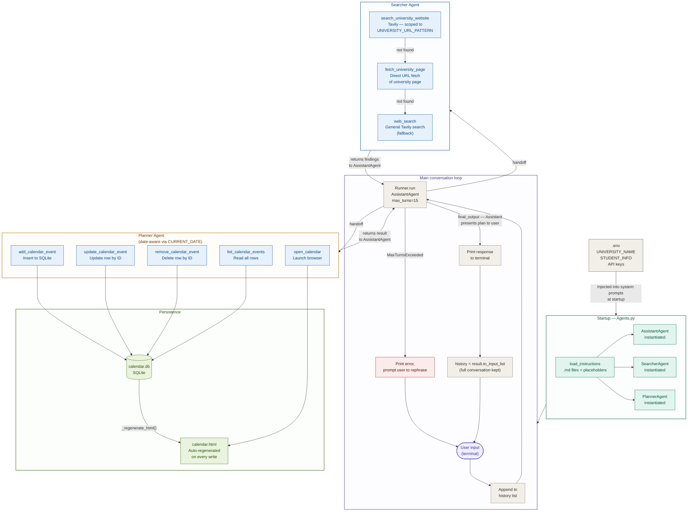

# Multi-Agent Planner — System Flowchart

This document describes the detailed workflow of the multi-agent planner system.

```mermaid
flowchart TD
    ENV[".env\nUNIVERSITY_NAME\nSTUDENT_INFO\nAPI keys"]:::env
    ENV -->|"Injected into system prompts\nat startup"| BOOT
    subgraph BOOT["Startup — Agents.py"]
        direction LR
        LD["load_instructions\n.md files + placeholders"]:::init
        LD --> AA["AssistantAgent\ninstantiated"]:::init
        LD --> SA["SearcherAgent\ninstantiated"]:::init
        LD --> PA["PlannerAgent\ninstantiated"]:::init
    end
    BOOT --> LOOP
    subgraph LOOP["Main conversation loop"]
        UI(["User input\n(terminal)"]):::user
        UI --> BUILD["Append to\nhistory list"]:::internal
        BUILD --> RUN["Runner.run\nAssistantAgent\nmax_turns=15"]:::internal
        RUN -->|"MaxTurnsExceeded"| ERR["Print error,\nprompt user to rephrase"]:::error
        ERR --> UI
        RUN -->|"final_output — Assistant\npresents plan to user"| PRINT["Print response\nto terminal"]:::internal
        PRINT --> HIST["history = result.to_input_list\n(full conversation kept)"]:::internal
        HIST --> UI
    end
    RUN -->|"handoff"| SEARCH
    RUN -->|"handoff"| PLAN
    subgraph SEARCH["Searcher Agent"]
        direction TB
        S1["search_university_website\nTavily — scoped to\nUNIVERSITY_URL_PATTERN"]:::tool
        S2["fetch_university_page\nDirect URL fetch\nof university page"]:::tool
        S3["web_search\nGeneral Tavily search\n(fallback)"]:::tool
        S1 -->|"not found"| S2
        S2 -->|"not found"| S3
    end
    SEARCH -->|"returns findings\nto AssistantAgent"| RUN
    subgraph PLAN["Planner Agent\n(date-aware via CURRENT_DATE)"]
        direction TB
        C1["add_calendar_event\nInsert to SQLite"]:::tool
        C2["update_calendar_event\nUpdate row by ID"]:::tool
        C3["remove_calendar_event\nDelete row by ID"]:::tool
        C4["list_calendar_events\nRead all rows"]:::tool
        C5["open_calendar\nLaunch browser"]:::tool
    end
    subgraph CALFILE["Persistence"]
        DB[(calendar.db\nSQLite)]:::store
        HTML["calendar.html\nAuto-regenerated\non every write"]:::store
    end
    C1 & C2 & C3 --> DB
    C4 --> DB
    DB -->|"_regenerate_html()"| HTML
    C5 --> HTML
    PLAN -->|"returns result\nto AssistantAgent"| RUN
    classDef env fill:#F1EFE8,stroke:#5F5E5A,stroke-width:1px,color:#2C2C2A
    classDef init fill:#E1F5EE,stroke:#0F6E56,stroke-width:1px,color:#085041
    classDef user fill:#EEEDFE,stroke:#534AB7,stroke-width:1.5px,color:#3C3489
    classDef internal fill:#F1EFE8,stroke:#888780,stroke-width:1px,color:#2C2C2A
    classDef tool fill:#E6F1FB,stroke:#185FA5,stroke-width:1px,color:#0C447C
    classDef store fill:#EAF3DE,stroke:#3B6D11,stroke-width:1px,color:#27500A
    classDef error fill:#FCEBEB,stroke:#A32D2D,stroke-width:1px,color:#501313
    style BOOT fill:#E1F5EE22,stroke:#0F6E56,stroke-width:1.5px,color:#085041
    style LOOP fill:#EEEDFE22,stroke:#534AB7,stroke-width:1.5px,color:#3C3489
    style SEARCH fill:#E6F1FB22,stroke:#185FA5,stroke-width:1.5px,color:#0C447C
    style PLAN fill:#FAEEDA22,stroke:#BA7517,stroke-width:1.5px,color:#633806
    style CALFILE fill:#EAF3DE22,stroke:#3B6D11,stroke-width:1.5px,color:#27500A
```